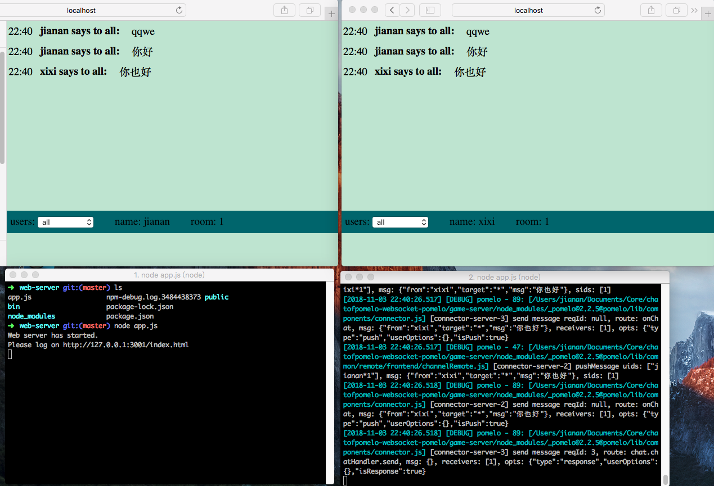

# 聊天demo

## 1)3个模块
*	pomelo   (单线程多进程服务器框架)
*	express  (web服务器)
*	crc      (加密冗余校验)

## 2)运行
*	node版本: v8.11.1
* 安装cnpm
   * npm install cnpm -g --registry=https://registry.npm.taobao.org

## 3)效果图

