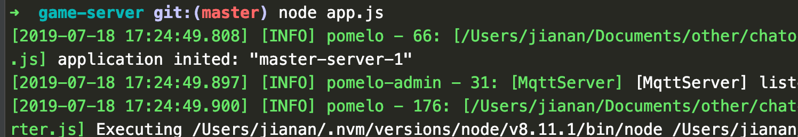
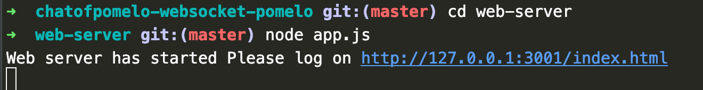

# 聊天demo

## 1)3个模块
*	pomelo   (单线程多进程服务器框架)
*	express  (web服务器)
*	crc      (加密冗余校验)

## 2)运行
*	node版本: v8.11.1
*  安装依赖库: sudo sh 1-npm-install.sh
*  全局安装: sudo npm install -g pomelo

## 3)效果图

* game-server启动

* web-server启动

* 游戏效果

